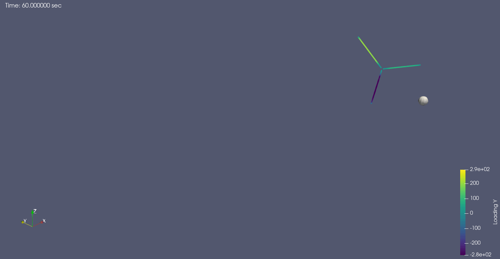
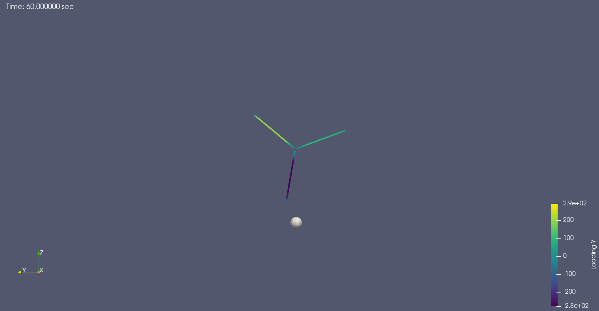

```@meta
CurrentModule = AADocs
```
# Compact Formulation 1A OpenFAST Example

## Introduction
This example loads a .out file generated by the popular aeroserohydroelastic
solver [OpenFAST](https://github.com/OpenFAST/openfast), which is released by
the U.S. National Renewable Energy Laboratory to simulate wind turbines, 
and then constructs the types used by AcousticAnalogies.jl for acoustic predictions. 
The example simulates the acoustic emissions of the 3.4MW land-based reference wind
turbine released by the International Wind Energy Agency. The OpenFAST model is available at
https://github.com/IEAWindTask37/IEA-3.4-130-RWT.

We start by loading Julia dependencies, which are available in the General registry
```@example first_example
using AcousticAnalogies: AcousticAnalogies
using AcousticMetrics: AcousticMetrics
using ColorSchemes: colorschemes
using FillArrays: FillArrays, getindex_value
using GLMakie
using KinematicCoordinateTransformations: SteadyRotYTransformation
using StaticArrays: @SVector
nothing # hide
```

## Inputs
Next, we set the user-defined inputs:
* number of blades, usually 3 for modern wind turbines
* hub radius in m, it is specified in the ElastoDyn main input file of OpenFAST
* blade spanwise grid in m and the corresponding chord, also in m. The two arrays are specified in the AeroDyn15 blade input file
* Observer location in the global coordinate frame (located at the rotor center, x points downwind, z points vertically up, and y points sideways). In this case we picked the IEC-prescribed location (turbine height on the ground) by specifying the hub height of 110 m.
* Air density and speed of sound
* Path to the OpenFAST .out file. The file must contain these channels: Time (always available), Wind1VelX from InflowWind, RotSpeed from ElastoDyn, Nodal outputs Fxl and Fyl from AeroDyn15. the file is available in the repo under test/gen_test_data/openfast_data

```@example first_example
# num_blades = 3
Rhub = 2.
BlSpn = [0.0000e+00, 2.1692e+00, 4.3385e+00, 6.5077e+00, 8.6770e+00, 1.0846e+01, 1.3015e+01, 1.5184e+01, 
    1.7354e+01, 1.9523e+01, 2.1692e+01, 2.3861e+01, 2.6031e+01, 2.8200e+01, 3.0369e+01, 3.2538e+01, 
    3.4708e+01, 3.6877e+01, 3.9046e+01, 4.1215e+01, 4.3385e+01, 4.5554e+01, 4.7723e+01, 
    4.9892e+01, 5.2062e+01, 5.4231e+01, 5.6400e+01, 5.8570e+01, 6.0739e+01, 6.2908e+01]
Chord = [2.600e+00, 2.645e+00, 3.020e+00, 3.437e+00, 3.781e+00, 4.036e+00, 4.201e+00, 
    4.284e+00, 4.288e+00, 4.223e+00, 4.098e+00, 3.923e+00, 3.709e+00, 3.468e+00, 3.220e+00, 
    2.986e+00, 2.770e+00, 2.581e+00, 2.412e+00, 2.266e+00, 2.142e+00, 2.042e+00, 1.964e+00, 
    1.909e+00, 1.870e+00, 1.807e+00, 1.666e+00, 1.387e+00, 9.172e-01, 1.999e-01]
file_path = joinpath(@__DIR__, "..", "..", "test", "gen_test_data", "openfast_data", "IEA-3.4-130-RWT.out")
HH = 110. # m
RSpn = BlSpn .+ Rhub
x0 = @SVector [HH .+ RSpn[end], 0.0, -HH]
rho = 1.225  # kg/m^3
c0 = 340.0  # m/s
nothing # hide
```

For the monopole/thickness noise, we need the cross-sectional area at each radial station.
If we know the cross-sectional area per chord squared, we can find the cross-sectional area this way:

```@example first_example
# Cross-sectional area of each element in m**2. This is taking a bit of a shortcut—the value of `cs_area_over_chord_squared` does not actually correspond to the IEAWindTask37 turbine blade.
cs_area_over_chord_squared = 0.064
cs_area = cs_area_over_chord_squared .* Chord.^2
nothing # hide
```

Next, we'll use the [`read_openfast_file`](@ref) function to read the OpenFAST output file.
This will read the data in the file, but also do a bit of processing necessary for an acoustic prediction. 
Specifically, it will...

  * interpolate the cross-sectional area and loading from the blade element interfaces to the cell centers
  * use second-order finite differences to differentiate the loading with respect to time.
  * average the freestream velocity and RPM (if `average_freestream_vel` or `average_omega` keyword arguments are `true`)

The [`read_openfast_file` doc string](@ref read_openfast_file) has more information.

The output of `read_openfast_file` is a `OpenFASTData` `struct` that has fields like `time`, `omega`, `axial_loading`, etc. that are read from the output file, and also fields like `radii_mid`, `circum_loading_mid_dot` that are created after the output file is read.
Check out the [`OpenFASTData` doc string](@ref OpenFASTData) for a list of all the fields.

```@example first_example
# Read the data from the file and create an `OpenFASTData` object, a simple struct with fields like `time`, `omega`, `axial_loading`, etc.
data = AcousticAnalogies.read_openfast_file(file_path, RSpn, cs_area; average_freestream_vel=true, average_omega=true)
```

We can get the averaged rotation rate value from the `OpenFASTData` `struct` this way:

```@example first_example
omega_avg = getindex_value(data.omega)
@show omega_avg
nothing # hide
```

(When averaging rotation rate or freestream velocity, `read_openfast_file` uses a [`Fill`](https://juliaarrays.github.io/FillArrays.jl/stable/#FillArrays.Fill) `struct` from the [`FillArrays.jl`](https://github.com/JuliaArrays/FillArrays.jl) package to lazily represent the average `omega` value as a length-`num_times` `Vector`, and [`getindex_value`](https://juliaarrays.github.io/FillArrays.jl/stable/#FillArrays.getindex_value) is a function from `FillArrays.jl` that returns that single averaged value.
Could have also just indexed the `data.omega` array at the first value, or last, etc..)

```@example first_example
@show data.omega[1] data.omega[8] data.omega[end]
nothing # hide
```

Before we actually try an acoustic prediction, let's have a look at the loading.
We'll use the Makie plotting package to make the plots, and only plot 1 out of every 500 time steps (as seen in the `for tidx` line):

```@example first_example
ntimes_loading = size(data.axial_loading_mid, 1)
fig = Figure()
ax11 = fig[1, 1] = Axis(fig, xlabel="Span Position (m)", ylabel="Fx (N/m)", title="blade 1")
ax21 = fig[2, 1] = Axis(fig, xlabel="Span Position (m)", ylabel="Fy (N/m)")
ax12 = fig[1, 2] = Axis(fig, xlabel="Span Position (m)", ylabel="Fx (N/m)", title="blade 2")
ax22 = fig[2, 2] = Axis(fig, xlabel="Span Position (m)", ylabel="Fy (N/m)")
ax13 = fig[1, 3] = Axis(fig, xlabel="Span Position (m)", ylabel="Fx (N/m)", title="blade 3")
ax23 = fig[2, 3] = Axis(fig, xlabel="Span Position (m)", ylabel="Fy (N/m)")
num_blades = data.num_blades
colormap = colorschemes[:viridis]
time = data.time
sim_length_s = time[end] - time[begin]
for tidx in 1:500:ntimes_loading
    cidx = (time[tidx] - time[1])/sim_length_s
    l1 = lines!(ax11, data.radii_mid, data.axial_loading_mid[tidx,:,1], label ="b1", color=colormap[cidx])
    l1 = lines!(ax12, data.radii_mid, data.axial_loading_mid[tidx,:,2], label ="b2", color=colormap[cidx])
    l1 = lines!(ax13, data.radii_mid, data.axial_loading_mid[tidx,:,3], label ="b3", color=colormap[cidx])
    l2 = lines!(ax21, data.radii_mid, data.circum_loading_mid[tidx,:,1], label ="b1", color=colormap[cidx])
    l2 = lines!(ax22, data.radii_mid, data.circum_loading_mid[tidx,:,2], label ="b2", color=colormap[cidx])
    l2 = lines!(ax23, data.radii_mid, data.circum_loading_mid[tidx,:,3], label ="b3", color=colormap[cidx])
end

linkxaxes!(ax21, ax11)
linkxaxes!(ax12, ax11)
linkxaxes!(ax22, ax11)
linkxaxes!(ax13, ax11)
linkxaxes!(ax23, ax11)

linkyaxes!(ax12, ax11)
linkyaxes!(ax13, ax11)

linkyaxes!(ax22, ax21)
linkyaxes!(ax23, ax21)

hidexdecorations!(ax11, grid=false)
hidexdecorations!(ax12, grid=false)
hidexdecorations!(ax13, grid=false)
hideydecorations!(ax12, grid=false)
hideydecorations!(ax13, grid=false)
hideydecorations!(ax22, grid=false)
hideydecorations!(ax23, grid=false)

cbar = fig[:, 4] = Colorbar(fig; limits=(time[begin], time[end]), colormap=:viridis, label="time (sec)")

save(joinpath(@__DIR__, "openfast_example_loading.png"), fig)
nothing # hide
```


The x axis of each subplot is the radial position along the blade, from hub to tip.
The top three plots show the axial loading, bottom three the circumferential, and there's one column for each blade.
And the colorbar indicates the simulation time.
The plot shows significant unsteadiness, which is cool to see.

We can also plot the loading time derivative in a similar form:

```@example first_example
ntimes_loading = size(data.axial_loading_mid_dot, 1)
fig = Figure()
ax11 = fig[1, 1] = Axis(fig, xlabel="Span Position (m)", ylabel="∂Fx/∂t (N/(m*s))", title="blade 1")
ax21 = fig[2, 1] = Axis(fig, xlabel="Span Position (m)", ylabel="∂Fy/∂t (N/(m*s))")
ax12 = fig[1, 2] = Axis(fig, xlabel="Span Position (m)", ylabel="∂Fx/∂t (N/(m*s))", title="blade 2")
ax22 = fig[2, 2] = Axis(fig, xlabel="Span Position (m)", ylabel="∂Fy/∂t (N/(m*s))")
ax13 = fig[1, 3] = Axis(fig, xlabel="Span Position (m)", ylabel="∂Fx/∂t (N/(m*s))", title="blade 3")
ax23 = fig[2, 3] = Axis(fig, xlabel="Span Position (m)", ylabel="∂Fy/∂t (N/(m*s))")
num_blades = data.num_blades
colormap = colorschemes[:viridis]
time = data.time
sim_length_s = time[end] - time[begin]
for tidx in 1:500:ntimes_loading
    cidx = (time[tidx] - time[1])/sim_length_s
    l1 = lines!(ax11, data.radii_mid, data.axial_loading_mid_dot[tidx,:,1], label ="b1", color=colormap[cidx])
    l1 = lines!(ax12, data.radii_mid, data.axial_loading_mid_dot[tidx,:,2], label ="b2", color=colormap[cidx])
    l1 = lines!(ax13, data.radii_mid, data.axial_loading_mid_dot[tidx,:,3], label ="b3", color=colormap[cidx])
    l2 = lines!(ax21, data.radii_mid, data.circum_loading_mid_dot[tidx,:,1], label ="b1", color=colormap[cidx])
    l2 = lines!(ax22, data.radii_mid, data.circum_loading_mid_dot[tidx,:,2], label ="b2", color=colormap[cidx])
    l2 = lines!(ax23, data.radii_mid, data.circum_loading_mid_dot[tidx,:,3], label ="b3", color=colormap[cidx])
end

linkxaxes!(ax21, ax11)
linkxaxes!(ax12, ax11)
linkxaxes!(ax22, ax11)
linkxaxes!(ax13, ax11)
linkxaxes!(ax23, ax11)

linkyaxes!(ax12, ax11)
linkyaxes!(ax13, ax11)

linkyaxes!(ax22, ax21)
linkyaxes!(ax23, ax21)

hidexdecorations!(ax11, grid=false)
hidexdecorations!(ax12, grid=false)
hidexdecorations!(ax13, grid=false)
hideydecorations!(ax12, grid=false)
hideydecorations!(ax13, grid=false)
hideydecorations!(ax22, grid=false)
hideydecorations!(ax23, grid=false)

cbar = fig[:, 4] = Colorbar(fig; limits=(time[begin], time[end]), colormap=:viridis, label="time (sec)")

save(joinpath(@__DIR__, "openfast_example_loading_dot.png"), fig)
nothing # hide
```


## Constructing the Source Elements
Now, the next step is to turn the OpenFAST data into source elements.
This step is pretty easy, since there is a function called [`f1a_source_elements_openfast`](@ref f1a_source_elements_openfast) that takes the `OpenFASTData` `struct` and a few other parameters and will create the source elements for us.
But first we need to think about the coordinate system we'd like our source elements to be in.
Eventually, we want the turbine blades to be rotating about the positive x axis, with the freestream velocity pointing in the positive x axis.
But there are two things we need to account for to make that happen:

  * To do a proper noise prediction, AcousticAnalogies.jl needs the source elements' motion to be defined in a reference frame relative to the ambient fluid, not the ground.
    Put another way, we need to manipulate the source elements in a way so that it appears that there is no freestream velocity—that the ambient fluid is stationary.
    So instead of having blade elements that are only rotating about a fixed hub position relative to the ground in a freestream pointed in the positive x direction, we will have the blade elements translate in the *negative* x direction as they rotate, with no freestream velocity.
  * The `f1a_source_elements_openfast` routine puts the source elements in the Standard AcousticAnalogies.jl Reference Frame™, where the source elements 

    * begin with the hub (rotation center) at `x = 0` at source time `t = 0`
    * rotate about either the positive x or negative x axis (depending on the value of the `positive_x_rotation` argument).
    * translate in the positive x direction,

So, to make all this work, we'll initially have the source elements translate in the positive x direction (as required by `f1a_source_elements_openfast`) and rotate about the *negative* x axis.
Then we'll rotate the source elements 180° about the y axis, which will mean they will be translating in the negative x axis, rotating about the positive y axis, just like what we intend.

So, here's the first step: create the source elements from the `OpenFASTData` `struct`, where they'll be rotating about the negative x axis, translating along the positive x axis.

```@example first_example
positive_x_rotation = false
ses_before_roty = AcousticAnalogies.f1a_source_elements_openfast(data, rho, c0, positive_x_rotation)
nothing # hide
```

The `f1a_source_elements_openfast` returns an array of [`CompactF1ASourceElement`] `structs`.
The array is of size `(num_times, num_radial, num_blades)`, where `ses[i, j, k]` refers to the source element of the `i`th time step, `j`th radial position, and `k`th blade:

```@example first_example
@show size(ses_before_roty)
nothing # hide
```

Now we'll rotate each source element 180° about the positive y axis.

```@example first_example
# Create the object from KinematicCoordinateTransformations.jl defining the 180° rotation about the y axis.
rot180degy = SteadyRotYTransformation(0, 0, pi)

# Now rotate the source elements.
ses = rot180degy.(ses_before_roty)

# Could have combined all that in one line, i.e.,
# ses = rot180degy.(AcousticAnalogies.f1a_source_elements_openfast(data, rho, c0, positive_x_rotation))
nothing # hide
```

## Defining the Observer
The last thing we need before we can perform the noise prediction is an acoustic observer.
The observer is just the computational equivalent of the microphone.
In this case we picked the IEC-prescribed location (turbine height on the ground) by specifying the hub height of 110 m.
So we need the observer to be 110 m below the hub.
We'll also have the observer positioned downstream of the turbine rotation plane by a certain amount.

```@example first_example
x0_obs = @SVector [HH + RSpn[end], 0.0, -HH]
nothing # hide
```

(The `@SVector` macro creates a statically-size vector using the [StaticArrays.jl](https://github.com/JuliaArrays/StaticArrays.jl) package, which is good for performance but not required.)

Now, just like with the source elements, we need to define the motion of the observer relative to the fluid, not the ground.
So, we'll use the same trick that we used with the source elements: have the observer translate in the negative x direction to account for the freestream velocity that's pointed in the positive x direction:

```@example first_example
# Get the average freestream velocity from the OpenFAST data.
v_avg = getindex_value(data.v)

# Create a vector defining the velocity of the observer.
v_obs = @SVector [-v_avg, 0, 0]
nothing # hide
```

Since the observer is moving, its position is obviously changing.
So the `x0_obs` will be the position of the observer at the start of the simulation, at the first source time level of the source elements.
We can get that first source time level this way:

```@example first_example
t0_obs = data.time[1]
nothing # hide
```

Now we have enough information to create the observer object:

```@example first_example
obs = AcousticAnalogies.ConstVelocityAcousticObserver(t0_obs, x0_obs, v_obs)
nothing # hide
```

That says that we want our observer to start at the location `x0_obs` at time `t0_obs`, and then move with constant velocity `v_obs` forever after.
After creating the observer, we can query its location at any time value after this way:

```@example first_example
@show obs(t0_obs) # should be equal to `x0_obs`
@show obs(t0_obs + 1)
nothing # hide
```

## Visualization with VTK Files
That was a lot.
How will we know we did all that correctly?
The answer is: write out the source elements and observer we just created to VTK files, and then visualize them with our favorite visualization software (ParaView at the moment).

The function we want is [`to_paraview_collection`](@ref).
Using it is simple:

```@example first_example
AcousticAnalogies.to_paraview_collection("openfast_example_with_obs", (ses,); observers=(obs,))
nothing # hide
```

(This form of `to_paraview_collection` expects multiple arrays of source elements and multiple observers.
But here we just have one array of source elements (`ses`) and one observer (`obs`), so we wrap each in a single-entry tuple, i.e., `(ses,)` and `(obs,)`.)

That will write out a bunch of VTK files showing the motion of the source elements and the observer, all starting with the `name` argument to the function (`openfast_example_with_obs` here).
The one to focus on is `openfast_example_with_obs.pvd`, a [ParaView data file](https://www.paraview.org/Wiki/ParaView/Data_formats#PVD_File_Format) that describes how all the many VTK files that `to_paraview_collection` writes out fit together.

The VTK files for the source elements will also contain all the data defined in the source element `struct`s (the loading, cross-sectional area, etc.).
That's really handy for checking that the loading is in the correct direction (remember, it needs to be the loading on the fluid, i.e. exactly opposite the loading on the blades).

To that end, here's an animation of the blades and observer, with the blades colored by the loading per unit span in the y direction:



Things look pretty good: the observer (i.e. the gray sphere) and the blades are all translating in the negative x direction, and the blades are rotating about the positive x axis.
(The gray smearing along the path of the observer is an artifact of the compression process the `gif` went through to make the file smaller.)
The y-component of the loading also appears to be in the correction direction: for a wind turbine, we'd expect the loading on the fluid to oppose the motion of the blade in the circumferential direction, which is what the animation shows.

One thing that is troubling about the previous animation is the location of the observer relative to the blades in the y direction.
Since the rotor hub starts at the origin and moves along the negative x axis, and since y component of the observer position is always zero, the observer should only be offset in the x and z directions relative to the hub path.
That's hard to see in the previous animation, but if we switch our perspective to be looking directly downstream (i.e., looking in the positive-x direction), everything appears as it should be:



## Noise Prediction
Now we're finally ready to do a noise prediction!
The relevant function for that is [`noise`](@ref), which takes in a source element and observer and returns an [`F1AOutput`](@ref) `struct`, representing the acoustic pressure experienced by the observer due to the source:

```@example first_example
apth = AcousticAnalogies.noise.(ses, Ref(obs))
nothing # hide
```

Notice that we used a `.` after the `noise` function, which [broadcasts](https://docs.julialang.org/en/v1/manual/arrays/#Broadcasting) the `noise` call over all source element-observer combinations.
(The `Ref(obs)` makes the single observer `struct` act as a scalar during broadcasting, meaning the same observer object is passed to each `noise` call.)
Because of the broadcasting, `apth` is an `Array` of `F1AOutput` `structs` with the same size as `ses`:

```@example first_example
@show size(ses) size(apth)
nothing # hide
```

We now have a noise prediction for each of the individual source elements in `ses` at the acoustic observer obs—specifically, `apth[i, j, k]` represents the acoustic pressure for the `i` time step, `j` radial location, and `k` blade.
What we ultimately want is the total noise prediction at `obs`—we want to add all the acoustic pressures for each time level in `apth` together. 
But we can't add them directly, yet, since the observer times, the time at which each source's noise reaches the observer, are not all the same.
What we need to do is first interpolate the acoustic pressure time history of each source onto a common observer time grid, and then add them up. 
We'll do this using the [`combine`](@ref) function.
First, we need to decide on the length of the observer time grid and how many points it will contain.
If the motion and loading of the blades was steady, then one blade pass would be sufficient, but for this example that is not the case, so we'll use a longer observer time:

```@example first_example
rev_period = 2*pi/omega_avg
bpp = rev_period/num_blades  # blade passing period
omega_rpm = omega_avg * 60/(2*pi)
obs_time_range = sim_length_s/60*omega_rpm*bpp
num_obs_times = length(data.time)
nothing # hide
```

So that says that we'll have an output observer time length of `obs_time_range` with `num_obs_times` points.
Note that we need to be careful to avoid extrapolation in the `combine` calculation, which will happen if the observer time specified via the `obs_time_range` and `num_obs_times` arguments to `combine` extends past the times contained in the `apth` array.
That won't happen in this case, since `obs_time_range/sim_length_s` is 1/3, so the observer time range is much less than the source time range.

Now we call `combine` to get the total acoustic pressure time history:

```@example first_example
time_axis = 1
apth_total = AcousticAnalogies.combine(apth, obs_time_range, num_obs_times, time_axis)
nothing # hide
```

With that, we're finally able to plot the acoustic pressure time history:

```@example first_example
fig = Figure()
ax1 = fig[1, 1] = Axis(fig, xlabel="time, s", ylabel="monopole, Pa")
ax2 = fig[2, 1] = Axis(fig, xlabel="time, s", ylabel="dipole, Pa")
ax3 = fig[3, 1] = Axis(fig, xlabel="time, s", ylabel="total, Pa")
l1 = lines!(ax1, time, apth_total.p_m)
l2 = lines!(ax2, time, apth_total.p_d)
l3 = lines!(ax3, time, apth_total.p_m.+apth_total.p_d)
hidexdecorations!(ax1, grid=false)
hidexdecorations!(ax2, grid=false)
save(joinpath(@__DIR__, "openfast-apth_total.png"), fig)
nothing # hide
```


The plot shows that the monopole/thickness noise is much lower than the dipole/loading noise.
Wind turbine blades are relatively slender, which would tend to reduce thickness noise.
Also the observer is downstream of the rotation plane, which is where loading noise is traditionally 
thought to dominate (monopole/thickness noise is more significant in the rotor rotation plane, usually).
(Although we didn't use the actual cross-sectional area for the blades, which directly affects the monopole/thickness noise.)

We now calculate the overall sound pressure level from the acoustic pressure time history.
Next, we will calculate the narrowband spectrum.
Finally, we will calculate the overall sound pressure level from the narrowband spectrum.

```@example first_example
oaspl_from_apth = AcousticMetrics.OASPL(apth_total)
nbs = AcousticMetrics.MSPSpectrumAmplitude(apth_total)
oaspl_from_nbs = AcousticMetrics.OASPL(nbs)
@show oaspl_from_apth oaspl_from_nbs
nothing # hide
```

The OASPL values calculated from the acoustic pressure time history and the narrowband spectrum are the same, as they should be according to [Parseval's theorem](https://en.wikipedia.org/wiki/Parseval%27s_theorem).
