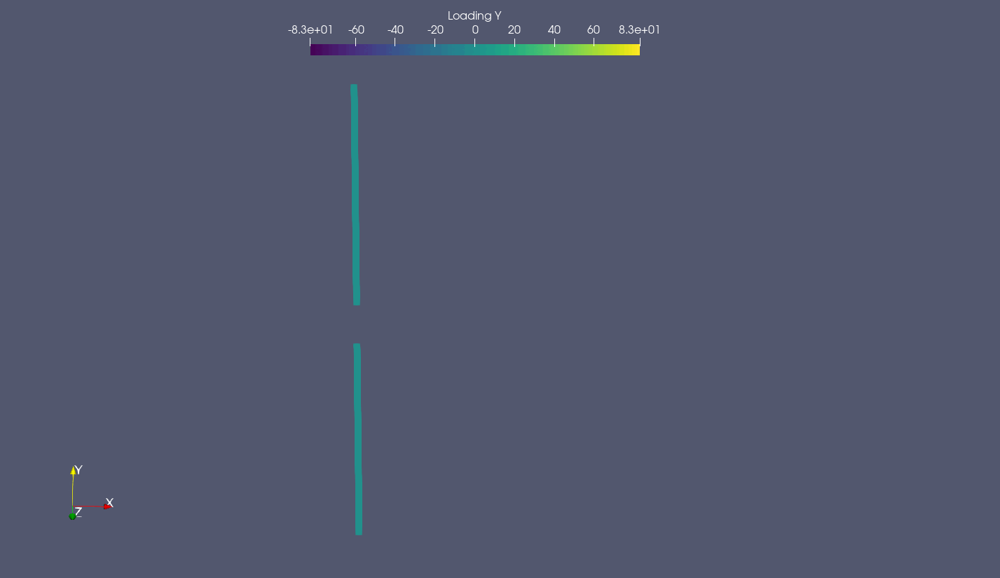

```@meta
CurrentModule = AADocs
```
# WriteVTK.jl Support

```@setup vtk_example
"""
    XROTORAirfoilConfig(A0, DCLDA, CLMAX, CLMIN, DCL_STALL, DCLDA_STALL, CDMIN, CLDMIN, DCDCL2, REREF, REXP, MCRIT)

`struct` that holds all the required parameters for XROTOR's approach to handling airfoil lift and drag polars.

# Arguments
- `A0`: zero lift angle of attack, radians.
- `DCLDA`: lift curve slope, 1/radians.
- `CLMAX`: stall Cl.
- `CLMIN`: negative stall Cl.
- `DCL_STALL`: CL increment from incipient to total stall.
- `DCLDA_STALL`: stalled lift curve slope, 1/radian.
- `CDMIN`: minimum Cd.
- `CLDMIN`: Cl at minimum Cd.
- `DCDCL2`: d(Cd)/d(Cl**2).
- `REREF`: Reynolds Number at which Cd values apply.
- `REXP`: Exponent for Re scaling of Cd:  Cd ~ Re**exponent
- `MCRIT`: Critical Mach number.
"""
struct XROTORAirfoilConfig{TF}
    A0::TF # = 0.           # zero lift angle of attack   radians
    DCLDA::TF # =  6.28     # lift curve slope            /radian
    CLMAX::TF # =   1.5     # stall Cl
    CLMIN::TF # =  -0.5     # negative stall Cl
    DCL_STALL::TF # =   0.1 # CL increment from incipient to total stall
    DCLDA_STALL::TF # = 0.1 # stalled lift curve slope    /radian
    CDMIN::TF # =  0.013    # minimum Cd
    CLDMIN::TF # =  0.5     # Cl at minimum Cd
    DCDCL2::TF # =  0.004   # d(Cd)/d(Cl**2)
    REREF::TF # =  200000.  # Reynolds Number at which Cd values apply
    REXP::TF # =  -0.4      # Exponent for Re scaling of Cd:  Cd ~ Re**exponent
    MCRIT::TF # =  0.8      # Critical Mach number
end


function XROTORAirfoilConfig(; A0, DCLDA, CLMAX, CLMIN, DCL_STALL, DCLDA_STALL, CDMIN, CLDMIN, DCDCL2, REREF, REXP, MCRIT)
    return XROTORAirfoilConfig(A0, DCLDA, CLMAX, CLMIN, DCL_STALL, DCLDA_STALL, CDMIN, CLDMIN, DCDCL2, REREF, REXP, MCRIT)
end

"""
    af_xrotor(alpha, Re, Mach, config::XROTORAirfoilConfig)

Return a tuple of the lift and drag coefficients for a given angle of attach
`alpha` (in radians), Reynolds number `Re`, and Mach number `Mach`.
"""
function af_xrotor(alpha, Re, Mach, config::XROTORAirfoilConfig)
# C------------------------------------------------------------
# C     CL(alpha) function
# C     Note that in addition to setting CLIFT and its derivatives
# C     CLMAX and CLMIN (+ and - stall CL's) are set in this routine
# C     In the compressible range the stall CL is reduced by a factor
# C     proportional to Mcrit-Mach.  Stall limiting for compressible 
# C     cases begins when the compressible drag added CDC > CDMstall
# C------------------------------------------------------------
# C     CD(alpha) function - presently CD is assumed to be a sum
# C     of profile drag + stall drag + compressibility drag
# C     In the linear lift range drag is CD0 + quadratic function of CL-CLDMIN
# C     In + or - stall an additional drag is added that is proportional
# C     to the extent of lift reduction from the linear lift value.
# C     Compressible drag is based on adding drag proportional to 
# C     (Mach-Mcrit_eff)^MEXP
# C------------------------------------------------------------
# C     CM(alpha) function - presently CM is assumed constant,
# C     varying only with Mach by Prandtl-Glauert scaling
# C------------------------------------------------------------
# C
      # INCLUDE 'XROTOR.INC'
      # LOGICAL STALLF
      # DOUBLE PRECISION ECMIN, ECMAX
# C
# C---- Factors for compressibility drag model, HHY 10/23/00
# C     Mcrit is set by user
# C     Effective Mcrit is Mcrit_eff = Mcrit - CLMFACTOR*(CL-CLDmin) - DMDD
# C     DMDD is the delta Mach to get CD=CDMDD (usually 0.0020)
# C     Compressible drag is CDC = CDMFACTOR*(Mach-Mcrit_eff)^MEXP
# C     CDMstall is the drag at which compressible stall begins
#
      A0 = config.A0
      DCLDA = config.DCLDA
      CLMAX = config.CLMAX
      CLMIN = config.CLMIN
      DCL_STALL = config.DCL_STALL
      DCLDA_STALL = config.DCLDA_STALL
      CDMIN = config.CDMIN
      CLDMIN = config.CLDMIN
      DCDCL2 = config.DCDCL2
      REREF = config.REREF
      REXP = config.REXP
      MCRIT = config.MCRIT
      
      CDMFACTOR = 10.0
      CLMFACTOR =  0.25
      MEXP      =  3.0
      CDMDD     =  0.0020
      CDMSTALL  =  0.1000
# C
# C---- Prandtl-Glauert compressibility factor
      # MSQ   =   W*W*VEL^2/VSO^2
      # MSQ_W = 2.0*W*VEL^2/VSO^2
      # if (MSQ>1.0)
      #  # WRITE(*,*)
     # # &  'CLFUNC: Local Mach number limited to 0.99, was ', MSQ
      #  MSQ = 0.99
      #  # MSQ_W = 0.
      # end
      MSQ = Mach*Mach
      if MSQ > 1.0
          MSQ = 0.99
          Mach = sqrt(MSQ)
      end
      PG = 1.0 / sqrt(1.0 - MSQ)
      # PG_W = 0.5*MSQ_W * PG^3
# C
# C---- Mach number and dependence on velocity
      # Mach = sqrt(MSQ)
      # MACH_W = 0.0
      # IF(Mach.NE.0.0) MACH_W = 0.5*MSQ_W/Mach 
      # if ! (mach ≈ 0.0)
      #     MACH_W =  0.5*MSQ_W/Mach
      # end
# C
# C
# C------------------------------------------------------------
# C--- Generate CL from dCL/dAlpha and Prandtl-Glauert scaling
      CLA     = DCLDA*PG  *(alpha-A0)
      # CLA_ALF = DCLDA*PG
      # CLA_W   = DCLDA*PG_W*(ALF-A0)
# C
# C--- Effective CLmax is limited by Mach effects
# C    reduces CLmax to match the CL of onset of serious compressible drag
      CLMX = CLMAX
      CLMN = CLMIN
      DMSTALL  = (CDMSTALL/CDMFACTOR)^(1.0/MEXP)
      CLMAXM = max(0.0, (MCRIT+DMSTALL-Mach)/CLMFACTOR) + CLDMIN
      CLMAX  = min(CLMAX,CLMAXM)
      CLMINM = min(0.0,-(MCRIT+DMSTALL-Mach)/CLMFACTOR) + CLDMIN
      CLMIN  = max(CLMIN,CLMINM)
# C
# C--- CL limiter function (turns on after +-stall 
      ECMAX = exp( min(200.0, (CLA-CLMAX)/DCL_STALL) )
      ECMIN = exp( min(200.0, (CLMIN-CLA)/DCL_STALL) )
      CLLIM = DCL_STALL * log( (1.0+ECMAX)/(1.0+ECMIN) )
      CLLIM_CLA = ECMAX/(1.0+ECMAX) + ECMIN/(1.0+ECMIN)
# c
# c      if(CLLIM.GT.0.001) then
# c      write(*,999) 'cla,cllim,ecmax,ecmin ',cla,cllim,ecmax,ecmin
# c      endif
# c 999  format(a,2(1x,f10.6),3(1x,d12.6))
# C
# C--- Subtract off a (nearly unity) fraction of the limited CL function
# C    This sets the dCL/dAlpha in the stalled regions to 1-FSTALL of that
# C    in the linear lift range
      FSTALL = DCLDA_STALL/DCLDA
      CLIFT  = CLA     - (1.0-FSTALL)*CLLIM

      # CL_ALF = CLA_ALF - (1.0-FSTALL)*CLLIM_CLA*CLA_ALF
      # CL_W   = CLA_W   - (1.0-FSTALL)*CLLIM_CLA*CLA_W
# C
      # STALLF = false
      # IF(CLIFT.GT.CLMAX) STALLF = .TRUE.
      # IF(CLIFT.LT.CLMIN) STALLF = .TRUE.
      # STALLF = (CLIFT > CLMAX) || (CLIFT < CLMIN)

# C
# C
# C------------------------------------------------------------
# C--- CM from CMCON and Prandtl-Glauert scaling
      # CMOM  = PG*CMCON
      # CM_AL = 0.0
      # CM_W  = PG_W*CMCON
# C
# C
# C------------------------------------------------------------
# C--- CD from profile drag, stall drag and compressibility drag 
# C
# C---- Reynolds number scaling factor
      if (Re < 0.0)
        RCORR = 1.0
        # RCORR_REY = 0.0
      else
        RCORR     = (Re/REREF)^REXP
        # RCORR_REY =  REXP/Re
      end
# C
# C--- In the basic linear lift range drag is a function of lift
# C    CD = CD0 (constant) + quadratic with CL)
      CDRAG  = (CDMIN + DCDCL2*(CLIFT-CLDMIN)^2    ) * RCORR
      # CD_ALF = (    2.0*DCDCL2*(CLIFT-CLDMIN)*CL_ALF) * RCORR
      # CD_W   = (    2.0*DCDCL2*(CLIFT-CLDMIN)*CL_W  ) * RCORR
      # CD_REY = CDRAG*RCORR_REY
# C
# C--- Post-stall drag added
      FSTALL = DCLDA_STALL/DCLDA
      DCDX    = (1.0-FSTALL)*CLLIM/(PG*DCLDA)
# c      write(*,*) 'cla,cllim,fstall,pg,dclda ',cla,cllim,fstall,pg,dclda
      DCD     = 2.0* DCDX^2
      # DCD_ALF = 4.0* DCDX * (1.0-FSTALL)*CLLIM_CLA*CLA_ALF/(PG*DCLDA)
      # DCD_W = 4.0* DCDX * ( (1.0-FSTALL)*CLLIM_CLA*CLA_W/(PG*DCLDA) - DCD/PG*PG_W )
# c      write(*,*) 'alf,cl,dcd,dcd_alf,dcd_w ',alf,clift,dcd,dcd_alf,dcd_w
# C
# C--- Compressibility drag (accounts for drag rise above Mcrit with CL effects
# C    CDC is a function of a scaling factor*(M-Mcrit(CL))^MEXP
# C    DMDD is the Mach difference corresponding to CD rise of CDMDD at MCRIT
      DMDD = (CDMDD/CDMFACTOR)^(1.0/MEXP)
      CRITMACH = MCRIT-CLMFACTOR*abs(CLIFT-CLDMIN) - DMDD
      # CRITMACH_ALF  = -CLMFACTOR*ABS(CL_ALF)
      # CRITMACH_W    = -CLMFACTOR*ABS(CL_W)
      if (Mach < CRITMACH)
        CDC     = 0.0
        # CDC_ALF = 0.0
        # CDC_W   = 0.0
      else
        CDC = CDMFACTOR*(Mach-CRITMACH)^MEXP
        # CDC_W   = MEXP*MACH_W*CDC/Mach - MEXP*CRITMACH_W  *CDC/CRITMACH
        # CDC_ALF =                      - MEXP*CRITMACH_ALF*CDC/CRITMACH
      end
# c      write(*,*) 'critmach,mach ',critmach,mach
# c      write(*,*) 'cdc,cdc_w,cdc_alf ',cdc,cdc_w,cdc_alf
# C
      FAC   = 1.0
      # FAC_W = 0.0
# C--- Although test data does not show profile drag increases due to Mach # 
# C    you could use something like this to add increase drag by Prandtl-Glauert
# C    (or any function you choose) 
# cc      FAC   = PG
# cc      FAC_W = PG_W
# C--- Total drag terms
      CDRAG  = FAC*CDRAG              + DCD     + CDC
      # CD_ALF = FAC*CD_ALF             + DCD_ALF + CDC_ALF
      # CD_W   = FAC*CD_W + FAC_W*CDRAG + DCD_W   + CDC_W
      # CD_REY = FAC*CD_REY
# C
      return CLIFT, CDRAG
end
```

AcousticAnalogies.jl can write out [`CompactF1ASourceElement`](@ref) `structs` to VTK
files, allowing us to easily visualize the state and motion of the acoustic
sources in popular visualization tools (e.g.
[ParaView](https://www.paraview.org/)). This is very useful for checking that
the motion, loading, coordinate system, etc. is what we expect.

To write out VTK files, we just need to pass an array of source elements to the
[`AcousticAnalogies.to_paraview_collection`](@ref) function. We'll use
[`CCBlade.jl`](https://github.com/byuflowlab/CCBlade.jl) to calculate the
aerodynamic loads, and the CCBlade.jl helper routines that AcousticAnalogies.jl
provides to create the source elements from the CCBlade.jl data.

```@example vtk_example
using AcousticAnalogies
using CCBlade

# Define the blade geometry.
B = 2
Rhub = 0.10
Rtip = 1.1684  # meters
radii = Rhub .+ range(0.0, 1.0, length=31).*(Rtip - Rhub)
radii = 0.5.*(radii[2:end] .+ radii[1:end-1])

cs_area_over_chord_squared = 0.064
chord = [
    0.35044     , 0.28260     , 0.22105     , 0.17787     , 0.14760,
    0.12567     , 0.10927     , 0.96661E-01 , 0.86742E-01 ,
    0.78783E-01 , 0.72287E-01 , 0.66906E-01 , 0.62387E-01 ,
    0.58541E-01 , 0.55217E-01 , 0.52290E-01 , 0.49645E-01 ,
    0.47176E-01 , 0.44772E-01 , 0.42326E-01 , 0.39732E-01 ,
    0.36898E-01 , 0.33752E-01 , 0.30255E-01 , 0.26401E-01 ,
    0.22217E-01 , 0.17765E-01 , 0.13147E-01 , 0.85683E-02 ,
    0.47397E-02].*Rtip

theta = [
    40.005, 34.201, 28.149, 23.753, 20.699, 18.516, 16.890, 15.633,
    14.625, 13.795, 13.094, 12.488, 11.956, 11.481, 11.053, 10.662,
    10.303, 9.9726, 9.6674, 9.3858, 9.1268, 8.8903, 8.6764, 8.4858,
    8.3193, 8.1783, 8.0638, 7.9769, 7.9183, 7.8889].*(pi/180)

# Define the operating point.
rpm = 2200.0
omega = rpm*(2*pi/60.0)
rho = 1.226  # kg/m^3
c0 = 340.0  # m/s
mu = 0.1780e-4  # kg/(m*s)
pitch = 0.0  # rad
Vinf = 5.0  # m/s

# Create an airfoil interpolation object.
xrotor_config = XROTORAirfoilConfig(
    A0=0.0, DCLDA=6.2800, CLMAX=1.5, CLMIN=-0.5, DCLDA_STALL=0.1,
    DCL_STALL=0.1, MCRIT=0.8, CDMIN=0.13e-1, CLDMIN=0.5, DCDCL2=0.4e-2, REREF=0.2e6, REXP=-0.4)
airfoil_interp(a, r, m) = af_xrotor(a, r, m, xrotor_config)

# Create the CCBlade.jl structs.
rotor = Rotor(Rhub, Rtip, B)
sections = Section.(radii, chord, theta, Ref(airfoil_interp))
ops = OperatingPoint.(Vinf, omega.*radii, rho, pitch, mu, c0)
outs = solve.(Ref(rotor), sections, ops)

# Create the AcousticAnalogies.jl source elements.
bpp = 60/(rpm*B)
period = 2*bpp
num_source_times = 64
positive_x_rotation = true
ses = f1a_source_elements_ccblade(rotor, sections, ops, outs, fill(cs_area_over_chord_squared, length(radii)), period, num_source_times, positive_x_rotation)
@show size(ses)
```
`ses` is an array of source elements of shape `(num_source_times, num_radial,
B)`, where `num_source_times` is the number of time steps over which the source
elements are defined, `num_radial` is the number of radial elements each blade
is subdivided into, and `B` is the number of blades.

Now that we have an array of source elements, we can write them out to VTK
files.
```@example vtk_example
name = "two_blade_example"
outfiles = AcousticAnalogies.to_paraview_collection(name, ses)
```
This will write out one polygonal VTK (`.vtp`) file per time step, along with a
ParaView collection (`.pvd`) file that allows us to open all of the `.vtp` files at once.

Here's an example visualization of the above example, showing an animation of
the loading in the `y` direction, which is normal to the rotation axis of the
rotor.

